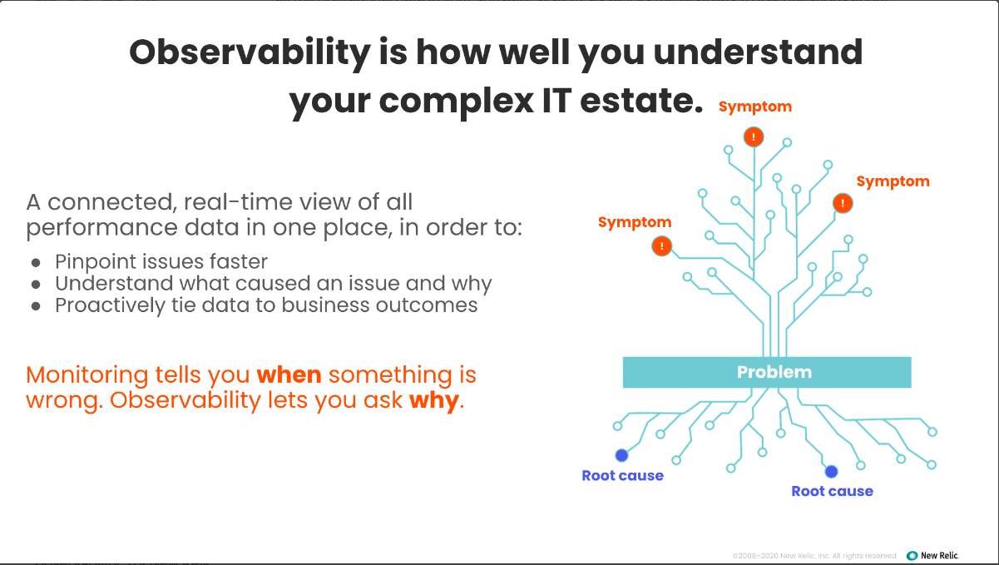
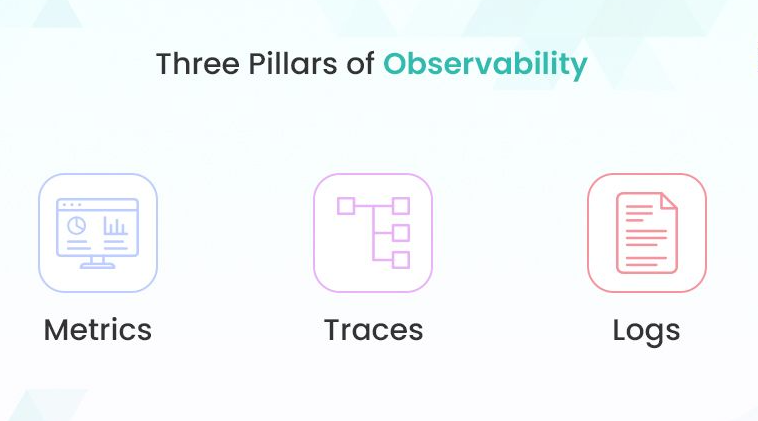
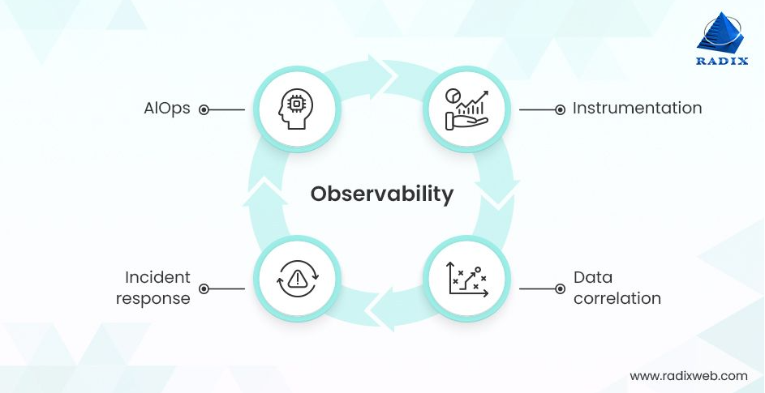
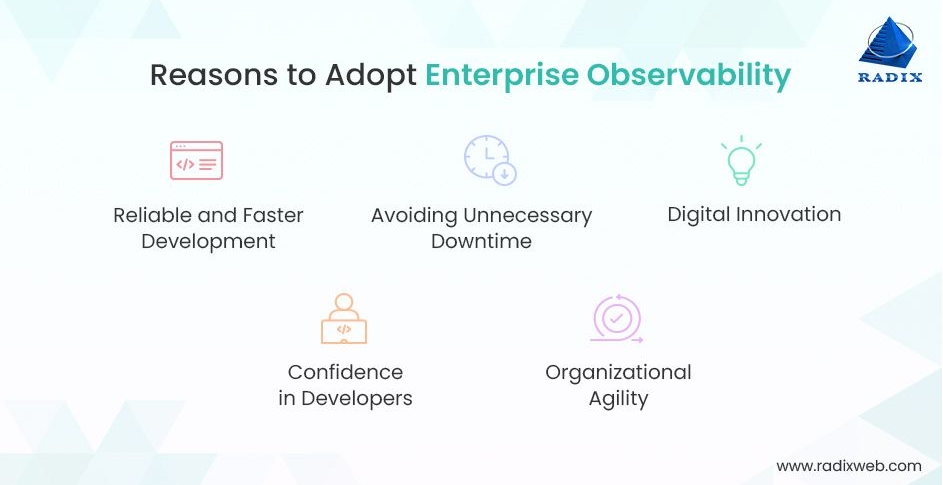

# Observability

## Table of Content

1. [Observability](#Observability)
2. [Table of Content](#Table-of-Content)
3. [What is Observability?](#What-is-Observability?)
4. [What is the Importance of Observability? Why Do You Need It?](#What-is-the-Importance-of-Observability?-Why-Do-You-Need-It?)
5. [Observability VS Monitoring](#Observability-VS-Monitoring)
   - [Example and Case for Observability](#Example-and-Case-for-Observability)
   - [Example and Case for Monitoring](#Example-and-Case-for-Monitoring)
6. [What are the Three Main Pillars of Observability?](#What-are-the-Three-Main-Pillars-of-Observability?)
   - [Logs](#Logs)
   - [Metrics](#Metrics)
   - [Tracing](#Tracing)
7. [What are the Four Key Components of Observability?](#What-are-the-Four-Key-Components-of-Observability?)
   - [Open Instrumentation](#Open-Instrumentation)
   - [Data Correlation and Context](#Data-Correlation-and-Context)
   - [Incident Management](#Incident-Management)
   - [AIOps Tools](#AIOps-Tools)
8. [What are the Benefits of Observability?](#What-are-the-Benefits-of-Observability?)
   - [Reliable and Faster Development](#Reliable-and-Faster-Development)
   - [Avoiding Unnecessary Downtime](#Avoiding-Unnecessary-Downtime)
   - [Digital Innovation](#Digital-Innovation)
   - [Confidence in Developers](#Confidence-in-Developers)
   - [Organizational Agility](#Organizational-Agility)
9. [What are the Common Challenges of Observability?](#What-are-the-Common-Challenges-of-Observability?)
   - [Manual Configurational and Instrumentation](#Manual-Configurational-and-Instrumentation)
   - [Siloed Data](#Siloed-Data)
   - [Extreme Troubleshooting](#Extreme-Troubleshooting)
10. [References](#References)

## What is Observability?

A simple way of describing observability is how well you can understand the system from the output. In control theory, observability is defined as how engineers can infer the internal states of a system from knowledge of that system's external outputs. 

Here's an amazing definition of observability that is on Reddit:

**“Observability is the board you see at an amusement park that shows you the wait time and whether or not a ride is open. It is all about knowing your systems so you know what is happening under the hood.”**

Observability gives engineers a proactive approach to analyze and optimize their systems based on the data it generates. Observability platforms provide a centralized way to collect, store, analyze, and visualize logs, metrics, and traces to provide a connected real-time view of all the operational data in your software system, as well as the flexibility to ask questions about your applications and infrastructure to understand system behavior and get to the answers you need to improve system performance.

## What is the Importance of Observability? Why Do You Need It?

When things went wrong back in the days of mainframes and static operations, it was pretty easy to understand why, and pre-configured static alerts based on known parameters to alert an operator of an issue. This was sufficient since these systems failed in similar ways over and over again.
As systems became more complex, monitoring tools attempted to shed light on what was happening with software performance. You could trace application performance with monitoring data and time-series analytics. It was a manageable process.

Today, the complexity is overwhelming. The possible causes of failure are abundant—and can feel infinite when you are staring at a screen, frustrated. Is a server down? Is your cloud provider having an outage? Did someone push new code that's impacting end-user behavior?

When working on these complex, distributed systems, identifying a broken link in the chain can be nearly impossible without an observability solution. Conventional monitoring can only track known unknowns. That means it won’t help you succeed in the complex world of microservices and distributed systems. It only tracks the things you know to ask about in advance (for example: “What’s my application’s throughput?”, “What does compute capacity look like?”, “Alert me when I exceed a certain error budget.”).

Now that microservices architectures are commonplace, responsibilities are distributed across teams, there's not a discrete app owner, and many teams need to be involved. Teams need to understand, analyze, and troubleshoot application areas they don’t necessarily own. Now you need modern tools like distributed tracing, which allows you to trace requests—and bottlenecks—through all parts of a distributed system.

## Observability VS Monitoring

- **Monitoring** is the process of collecting predefined metrics and data (like CPU usage, memory, and request rates) and watching for known issues and setting up alerts when something goes wrong. It focuses on detecting and reacting to predefined problems (like server downtime or high CPU usage).

- **Observability** is the ability to understand the internal state of a system based on the data (logs, metrics, traces) generated by that system. It allows you to explore and troubleshoot unexpected issues or unknown unknowns by digging into a system's detailed behavior in real time.
So, monitoring is about detection, while observability is s understanding the system and troubleshooting.

### Example and Case for Observability:

**Case:** Imagine you're running a distributed microservices application, and users report slow response times intermittently. Monitoring might show that CPU usage and memory are normal, and there are no obvious system-wide alerts. However, the issue persists.

**Why Observability:** In this case, observability helps because it allows you to trace individual requests across various microservices and find where bottlenecks are occurring. It might reveal that a specific database query is slow under certain conditions, which monitoring didn't catch since it wasn’t a predefined alert.

**Why Monitoring Alone Wouldn’t Work:** Monitoring tracks only the known metrics (like CPU usage or request rates). If none of these metrics cross a threshold, the system would seem healthy, but the root cause of the performance issue (like a slow query in a specific part of the system) remains hidden.

### Example and Case for Monitoring:

**Case:** Your web server crashes because it runs out of memory, and users can’t access your website.

**Why Monitoring:** Monitoring is effective here because it can alert you when memory usage crosses a certain threshold or when the server is down. It’s a known issue that can be tracked by predefined metrics and alerts.

**Why Observability Alone Wouldn’t Work:** Observability helps investigate complex or unknown issues, but in this case, the problem (out-of-memory crash) is simple and predefined. Monitoring is sufficient to detect the issue and trigger an alert.

## What are the Three Main Pillars of Observability?

Implementing on-premise or cloud observability doesn't have to be difficult, despite how complicated it may appear. Start by focusing on the following three crucial pillars that make observability successful:

### Logs

Logs are granular text records of certain events that took place over a specific period of time. Structured logging is a must-have for complex ecosystems with multiple components, like Kubernetes services as it enables developers to spot unpredict behavior in a system.

There are three different types of event logs:

- **Binary:** Binary logs are in the pflog, MySQL binlogs, or the protobuf format.
- **Structured:** These are JSON-formatted logs that can be sent in a structured way.
- **Plain text:** Plain text is the data that represents only characters of readable material.

### Metrics

Metrics is another key pillar of application observability that defines a numerical representation of data that you can compile over a timeframe. There can be various sources of metrics, including the infrastructure, hosts, and cloud platforms.
For example, metrics provide information on the number of requests processed by a service every second or how much memory a particular pipeline consumes.

### Tracing

Tracing represents activities of a request or transaction going on in a software product. You can identify bugs in the system and determine their root causes by capturing the traces of requests and figuring out what is happening across the request chain.
Since Tracing enables you to determine the true cause of each problem and define the amount of work executed at each component, it is the most crucial pillar of data observability.

## What are the Four Key Components of Observability?

Apart from the pillars, you must also develop a set of apps and tools that can gather the telemetry data in the form of logs, metrics, or traces in order to make your IT systems observable.
In every ecosystem, you can typically implement observability software by combining these four elements:

### Open Instrumentation

Open instrumentation refers to collecting, tracking, and measuring telemetry data moving through the software by using code or agents. Metrics, Events, Logs, and Traces, aka MELT, are examples of telemetry data. And containers, applications, hosts, and services are a few examples of entities.

### Data Correlation and Context

It's important to have a broad perspective, especially for large-scale enterprise software development that generates vast quantities of raw telemetry data. Hence, in order to understand any patterns or abnormalities in the acquired telemetry data, correlations, and context analysis are vital components of observability engineering.

### Incident Management

Incident management is a suite of procedures, methods, and techniques that collectively allows you to identify, look into, and respond to incidents. By rapidly resolving risks and vulnerabilities, IT teams can now minimize the overall impact of incidents and maintain the desired functionality of systems and services as per data compliance standards.

### AIOps Tools

Accelerating incident response is necessary if you want to ensure that your deployment infrastructure is constantly accessible with reduced false alarms, active identification of problems, and shorter mean time to resolution (MTTR). To automate IT operations including aggregating, correlating, and prioritizing incident data, AIOps tools leverage machine learning models.

## What are the Benefits of Observability?

You mean apart from gaining quick and easy access to data that simply shows how your system is operating? Not a problem! Here are some more reasons for you to adopt enterprise observability;

### Reliable and Faster Development

Observability leaders do much better than newcomers in terms of software quality metrics and KPIs. They are able to push products more quickly, with fewer issues, and with dramatically reduced downtime. And they can deal with problems more quickly when they arise.
According to the 2022 State of Observability Report by Splunk, 41% of organizations can identify issues in internally built apps within minutes. leading to a 37% improvement in the mean time to detection (MTTD).

Additionally, twice as many companies can resolve unpredicted downtime disruption in mission-critical software in four hours or less. As a result, the mean time to resolution (MTTR) has reportedly improved by 69%.

### Avoiding Unnecessary Downtime

Although it may seem like a broad category, organizations that practice full-stack observability are less likely to experience downtime and related expenses, both direct and indirect.
On average, they decrease the cost of downtime by over 90%. This fact is indeed a very persuasive vote for the power of observability. It streamlines the finding and debugging process for a software product since developers can observe the end-to-end journey of a request with contextualized data about a specific error.

### Digital Innovation

CIOs, CTOs, and other C-suite executives continue to place a high priority on achieving digital transformation. But if outages, downtimes, and other service issues continue to push back development teams, they will be unable to move forward.
Thus, helping teams relieve themselves of tedious tasks so they can be productive is one of the main objectives of tech leaders. And needless to say, the firms that have used observability tools are also the most creative.
As a matter of fact, 60% of DevOps organizations following observability have launched more products or created more revenue streams than beginners.

### Confidence in Developers

The two main advantages of observability are the ability to see what is happening and the capacity to fix problems more quickly, including before they break. Without a doubt, maintaining visibility in a complicated cloud environment is a unique and important issue. The fact that observability adoption is increasing at the same time that cloud usage is increasing may not come as a surprise.
Hence, system and data observability offer greater advantages as the infrastructure becomes more complicated. A developed observability practice increases developers'’ trust in their skills to provide an effective and ground-breaking digital experience.

### Organizational Agility

Observability helps businesses to view their entire IT infrastructure from a wider and more comprehensive perspective. It should not be surprising that this DevOps approach helps cross-functional teams in the company have an in-depth understanding and holistic point of view of the larger picture.
With the help of cloud observability, you can find issues you might not have known to look for or are aware of. Then you can track how they relate to certain performance problems, and get the context you need to quickly identify the causes of problems. For such a transparent and clear approach, there is a growing focus on collaboration and teamwork across the entire organization.

## What are the Common Challenges of Observability?

Although practicing observability has always been difficult, the rapid advancement of cloud technology and the complexity of microservices architecture have made it a burning issue for enterprises to address.
Take a look at a few of the observability challenges organizations usually run into:

### Manual Configurational and Instrumentation

When developers have to manually create and update code for every new type of agent and component, they spend the majority of their time trying to configure observability tools rather than focusing based on the observability data.

### Siloed Data

It is challenging to understand the interdependencies across various digital channels, different cloud platforms, and applications due to the huge number of siloed monitoring tools, different data sources, and agents.

### Extreme Troubleshooting

Teams from multiple departments gather to try to pinpoint and troubleshoot the source of issues, wasting valuable time making guesses, attempting to make sense of the telemetry data, and coming up with solutions.

### Environment Complexity

In large-scale cloud platforms like AWS, Azure, and Google Cloud Platform, the massive amount of raw data created from all the components makes it next to impossible to figure out the solution. this also includes containers and Kubernetes that can quickly scale up and down.

## How Do You Implement Observability?

There always should be a holistic approach to implementing the practices of observability engineering. And from our experience as a DevOps pioneer, here is how you should do it:
Key Steps to Implement Observability

1. **Define Your Goals**

To efficiently track application health, performance metrics, and deployment cycles, you must set a clear set of objectives. In order to make informed decisions regarding their DevOps processes, teams must establish accurate observability metrics that they to keep a track of.

2. **Understand the Contextual Topography**

In highly dynamic, multi-cloud setups with potentially millions of interconnected components, this step includes instrumenting in a way that generates an understanding of interactions between every interdependency. Real-time topology maps are the results of rich context metadata, which gives a definition of causal dependencies both horizontally across hosts, processes, and services, as well as vertically within the stack.

3. **Continuously Automate Processe*s**

When it comes to DevOps observability and monitoring, automation is highly critical because human checks are ineffective and prone to mistakes. With automation in place, teams can promptly identify errors, enhance performance KPIs, and make sure that all environments adhere to code quality and coding standards.

4. **Foster Cross-Platform Collaboration**

The involvement of multiple teams from development, operations, infrastructure, security, support, and other areas is necessary for monitoring and observability. Businesses can make sure that everyone has access to the same data points required for observability by encouraging collaboration between various departments and routinely sharing information.

5. **Consider External Factors**

APIs, network speed, and third-party services are a few examples of external factors that companies should assess since they could have a great impact on app performance monitoring. Evaluating external factors empower teams to find out any possible bottlenecks and proactively address them before they become a major issue.

6. **Use KPIs and SLAs to Measure Success**

Organizations should establish key performance indicators (KPIs) that track system performance as a whole and service level agreements (SLAs) that monitor software uptime in order to evaluate the success of their data observability initiative. Teams can use this to pinpoint areas for improvement and then modify their procedures as necessary.

7. **Enable Data Logging**

If at all possible, create standardized data logging using the Simple Network Management Protocol (SNMP) or other methods. In tools used to aggregate and collect data, you can occasionally enable data logging, but you should do it if it is not already.
Best Practices to Successfully Implement Observability

The main objective of DevOps observability is to provide correct visibility into your design and infrastructure. Nonetheless, there are several basic challenges you must overcome while establishing observability in your ecosystem.
Below is a list of the best practices you should follow to see observability in action for your development teams:

- Do not store all logs and data
- Do not monitor each and everything
- Enables alerts only for critical events
- Monitor only the things you need to fix
- Do not use default graphs
- Create a custom graph as per user needs
- Filter data to the point of creation
- Store the logs that provide information about critical events
- Enable alerts based on Grafana or Prometheus metrics
- Integrate automatic remediation systems with observability tools

## References

https://newrelic.com/blog/best-practices/what-is-observability#:~:text=Observability%20and%20DevOps&text=It's%20not%20just%20application%20code,they%20couldn't%20originally%20predict.
https://radixweb.com/blog/what-is-observability-in-devops

